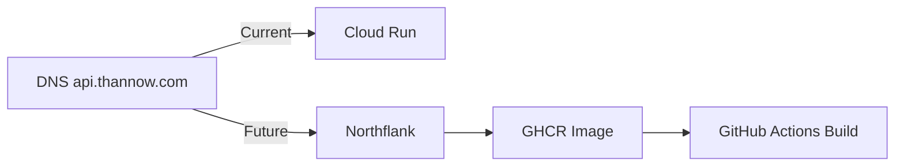

# OPS-130 — Cloud Run Retirement Checklist

**Date:** 2026-07-24

## Foreword

This checklist evaluates whether Cloud Run can be safely retired. **The current production infrastructure IS Cloud Run** (see `production_request_trace.md` and `cloudrun_report.md`). Retirement is NOT recommended.

## Pre-Retirement Verification

| # | Check | Status | Evidence |
|---|-------|--------|----------|
| 1 | Cloud Run receives 0% traffic | **❌ FAILED** | Cloud Run revision `00096-gkh` serves 100% of api.thannow.com traffic |
| 2 | No environment variables reference Cloud Run | **❌ FAILED** | Cloud Run env vars are the ONLY active production configuration |
| 3 | No provider references Cloud Run | **❌ FAILED** | Cloud Run IS the provider |
| 4 | No worker references Cloud Run | **❌ FAILED** | All worker config points to Cloud Run env |
| 5 | No deployment scripts reference Cloud Run | **❌ FAILED** | Dockerfile builds for Cloud Run target |
| 6 | No Deployment_Policy references Cloud Run | — | Deployment_Policy.md not found |
| 7 | No DNS origin points to Cloud Run | **❌ FAILED** | `api.thannow.com` → CNAME → Cloud Run |
| 8 | No health checks use Cloud Run | **❌ FAILED** | `GET /api/health` hits Cloud Run |

## Retirement Feasibility

| Criteria | Verdict |
|----------|---------|
| Can Cloud Run be retired now? | **NO** — It is the sole production backend |
| When could it be retired? | After Northflank migration is completed and verified |
| Migration required | Yes — complete Northflank deployment, point DNS, verify traffic |

## Migration to Northflank (If Desired)

Steps:
1. Configure Northflank GitHub integration webhook (currently a stub)
2. Add `ADMIN_BOOTSTRAP_EMAIL` and `ADMIN_BOOTSTRAP_PASSWORD` to Northflank secrets
3. Build and push Docker image to GHCR (GitHub Actions ✅ does this)
4. Verify Northflank service starts and health check passes
5. Point `api.thannow.com` DNS to Northflank load balancer
6. Monitor traffic shift
7. After verifying 100% traffic on Northflank, re-run this checklist
8. Only then consider Cloud Run retirement

## Recommendation

**DO NOT DELETE Cloud Run.** It is the production backend. The `northflank.json` configuration is aspirational and never completed.
